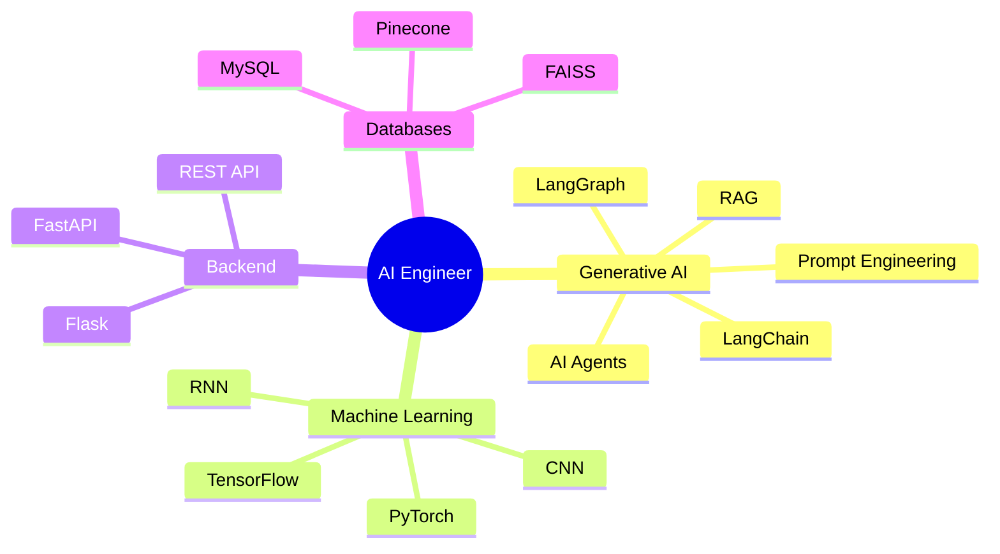
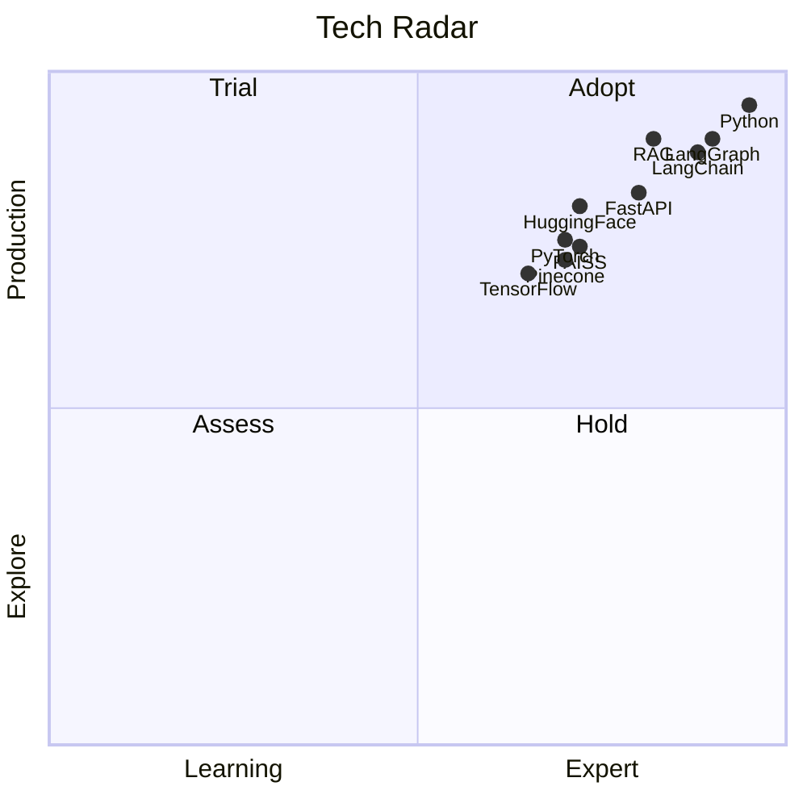
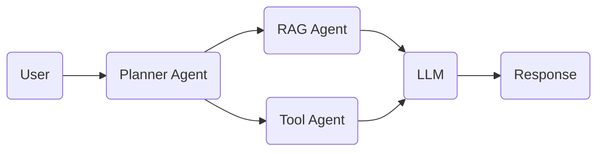
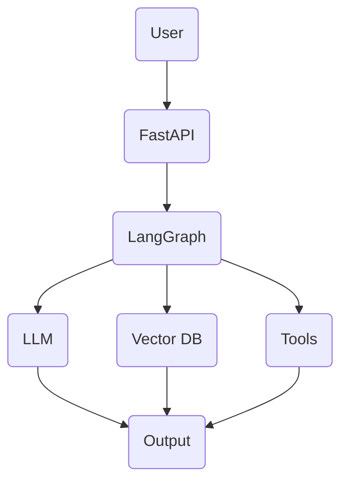
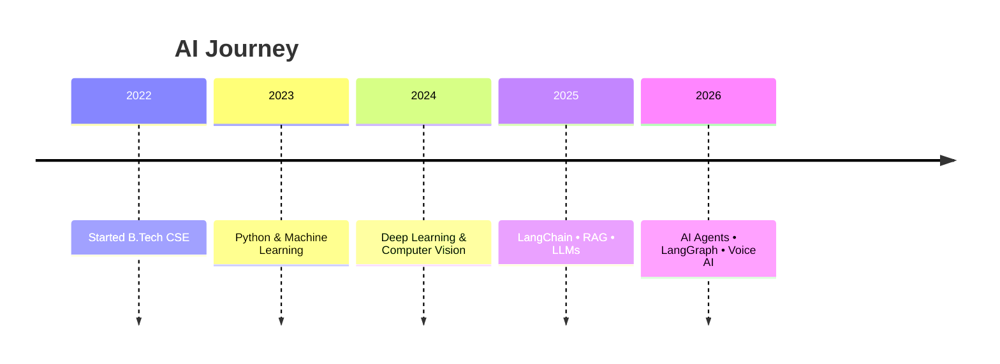

<!-- ========================================================= -->
<!--                       HERO SECTION                         -->
<!-- ========================================================= -->

<div align="center">


</div>

<div align="center">

<a href="https://git.io/typing-svg">


</a>

</div>

---

<div align="center">

### ⚡ Building Production-Ready AI Applications with LLMs, RAG & Agentic AI ⚡

</div>

---

# 🌐 Connect With Me

<div align="center">

<a href="mailto:kumarroypritam2@gmail.com">

</a>

<a href="https://www.linkedin.com/in/pritamkumarroy">

</a>

<a href="https://github.com/Pritam216">

</a>

<a href="https://pritam-kumar-roy.vercel.app">

</a>

<a href="https://www.kaggle.com/">

</a>

</div>

---

<div align="center">


</div>

---

<!-- ========================================================= -->
<!--                     AURORA DIVIDER                         -->
<!-- ========================================================= -->


<!-- ========================================================= -->
<!--                    BENTO ABOUT ME                         -->
<!-- ========================================================= -->

# 🧩 About Me

<table>
<tr>

<td width="50%" valign="top">

## 👨‍💻 Profile

```python
class PritamRoy:

    role = "AI Engineer"

    education = "B.Tech Computer Science"

    location = "Kolkata, India"

    interests = [
        "Generative AI",
        "AI Agents",
        "RAG",
        "LangGraph",
        "Machine Learning"
    ]

    gate_rank = "AIR 5159"

    status = "Building AI Applications"
```

</td>

<td width="50%" valign="top">

## 🏆 Highlights

🧠 AIR **5159** in **GATE 2026 (CS)**

🤖 Building production-ready AI systems

🚀 AI Agents using LangGraph

📚 Retrieval-Augmented Generation (RAG)

⚡ FastAPI Backend Development

🎙️ Voice AI Applications

</td>

</tr>

<tr>

<td width="50%" valign="top">

## 🌱 Currently Learning

- Advanced LangGraph
- Multi-Agent Systems
- Agentic AI
- Voice AI
- AI Automation
- Advanced RAG

</td>

<td width="50%" valign="top">

## 💬 Ask Me About

- Python
- LangGraph
- LangChain
- Hugging Face
- FastAPI
- AI Agents
- Transformers
- Prompt Engineering
- RAG Pipelines

</td>

</tr>

</table>

---

# 🤖 AI Terminal

```bash

> booting profile...

███████████████████████████████

✓ Python Loaded

✓ FastAPI Loaded

✓ LangChain Loaded

✓ LangGraph Loaded

✓ HuggingFace Loaded

✓ FAISS Connected

✓ Pinecone Connected

✓ AI Agents Initialized

✓ LLM Ready

✓ RAG Pipeline Ready

-----------------------------

STATUS      : ONLINE

MODE        : BUILDING AI

LOCATION    : INDIA

MODEL       : GPT + OPEN SOURCE LLMs

FRAMEWORKS  : LANGGRAPH

VERSION     : v2026

SYSTEM      : STABLE

```

---

# 🚀 Current Focus

| 🚀 Working On | 📖 Learning |
|--------------|------------|
| AI Agents | Multi-Agent Systems |
| LangGraph | Agent Memory |
| Voice AI | MCP |
| RAG Pipelines | AI Automation |
| FastAPI | Production AI |

---
<!-- ========================================================= -->
<!--                  SKILL GALAXY                             -->
<!-- ========================================================= -->

# 🌌 Skill Galaxy

<div align="center">

### ⭐ AI Engineering Ecosystem

</div>

<table>

<tr>

<td align="center" width="33%">

## 🤖 Generative AI

<p>

<br>


</p>

</td>

<td align="center" width="33%">

## 🧠 Machine Learning

<p>


<br>


</p>

</td>

<td align="center" width="33%">

## ⚡ Backend

<p>


<br>


</p>

</td>

</tr>

</table>

---

# 🛰️ AI Stack

<div align="center">

```text
                ┌──────────────────────────┐
                │     USER REQUEST         │
                └────────────┬─────────────┘
                             │
                             ▼
                      Prompt Engineering
                             │
                             ▼
                      LangGraph Workflow
                             │
             ┌───────────────┼───────────────┐
             ▼               ▼               ▼
         AI Agent        RAG Engine      LLM APIs
             │               │               │
             └───────────────┼───────────────┘
                             ▼
                         FastAPI Backend
                             │
                             ▼
                       Response to User
```

</div>

---

# 💻 Tech Stack

## 🖥️ Languages

<p>


</p>

---

## 🤖 AI / LLM

<p>


</p>

---

## 🧠 Machine Learning

<p>


<br>


</p>

---

## ⚡ Backend

<p>


</p>

---

## 🗄️ Database & Vector Store

<p>


<br>


</p>

---

## 🛠️ Developer Tools

<p>


<br>


</p>

---

## 📚 Core CS

<p>


</p>

---


# ⚡ Fun Facts

- 🏆 AIR **5159** in GATE 2026
- 💻 Passionate about solving real-world problems using AI
- 🤖 Love building production-ready AI applications
- 🌱 Always learning emerging AI technologies
- 🚀 Interested in AI Engineering & Research

---


<!-- ========================================================= -->
<!--              GITHUB ANALYTICS DASHBOARD                   -->
<!-- ========================================================= -->

# 📊 GitHub Analytics Dashboard

<table>

<tr>

<td width="50%">


</td>

<td width="50%">


</td>

</tr>

<tr>

<td width="50%">


</td>

<td width="50%">


</td>

</tr>

</table>

---

# 📈 Coding Activity

<p align="center">


</p>

---

# 📊 GitHub Summary

<p align="center">


</p>

---

# 🧠 AI Brain Mind Map



---

# 🎯 Tech Radar



---

# 🤖 Multi-Agent Workflow



---

# 🏗 AI Architecture



---

# 🕒 Interactive Timeline



---

# ⭐ Featured Projects

| Project | Description |
|---------|-------------|
| 🧠 DataMind-2.0 | LLM-powered EDA Agent |
| 🎙 Samvaad | AI Voice Assistant |
| 🖼 DeblurGANv2 | Image Deblurring using GANs |

---

# 📬 Contact

<div align="center">

<a href="mailto:kumarroypritam2@gmail.com">

</a>

<a href="https://www.linkedin.com/in/pritamkumarroy">

</a>

<a href="https://pritam-kumar-roy.vercel.app">

</a>

</div>

---

# 🐍 Contribution Snake

> Requires GitHub Actions setup.

<p align="center">


</p>

---

<div align="center">

### ⭐ Thanks for visiting!

Building intelligent AI systems with **LLMs • LangGraph • RAG • AI Agents**

</div>
