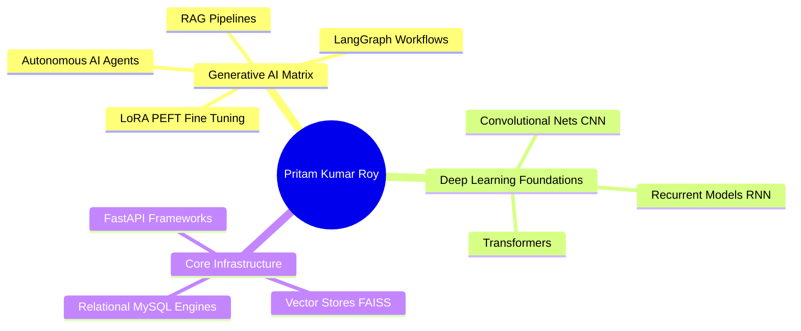

# 🪐 Hello World, I'm Pritam Kumar Roy! 

  <svg viewBox="0 0 850 260" width="100%" style="background: #0a0a12; font-family: 'Segoe UI', system-ui, sans-serif; border-radius: 12px; border: 2px solid #00f0ff; box-shadow: 0 0 20px rgba(0, 240, 255, 0.2);">
    <defs>
      <pattern id="cyber-grid" width="40" height="40" patternUnits="userSpaceOnUse">
        <path d="M 40 0 L 0 0 0 40" fill="none" stroke="#14142b" stroke-width="1"/>
      </pattern>
      <linearGradient id="neon-glow" x1="0%" y1="0%" x2="100%" y2="100%">
        <stop offset="0%" stop-color="#00f0ff" />
        <stop offset="50%" stop-color="#ff007f" />
        <stop offset="100%" stop-color="#7000ff" />
      </linearGradient>
    </defs>
    <rect width="100%" height="100%" fill="#06060e"/>
    <rect width="100%" height="100%" fill="url(#cyber-grid)"/>
    
    <path d="M 10 25 L 300 25 L 320 45 L 840 45" fill="none" stroke="#00f0ff" stroke-width="1" stroke-dasharray="5,5"/>
    <path d="M 10 235 L 530 235 L 550 215 L 840 215" fill="none" stroke="#ff007f" stroke-width="1"/>
    <circle cx="20" cy="25" r="3" fill="#00f0ff"/>
    <circle cx="830" cy="215" r="3" fill="#ff007f"/>

    <text x="50%" y="115" dominant-baseline="middle" text-anchor="middle" font-size="42" font-weight="900" fill="url(#neon-glow)" letter-spacing="6" style="filter: drop-shadow(0px 0px 8px rgba(0,240,255,0.6));">
      PRITAM KUMAR ROY
    </text>

    <text x="50%" y="170" dominant-baseline="middle" text-anchor="middle" font-size="18" font-weight="600" fill="#00f0ff" letter-spacing="2">
      GENERATIVE AI & SYSTEMS ENGINEER
      <animate attributeName="opacity" values="1;0;1" dur="2s" repeatCount="indefinite"/>
    </text>
    
    <text x="40" y="130" font-size="60" font-weight="100" fill="#1d1d3d">&lt;</text>
    <text x="780" y="130" font-size="60" font-weight="100" fill="#1d1d3d">&gt;</text>
  </svg>

 

  
  
  
  
  

---

## 👤 Executive Profile

<table width="100%" border="0" cellpadding="10" cellspacing="0" style="border-collapse: collapse;">
  <tr>
    <td width="55%" valign="top" style="border: none; padding: 6px;">
      <svg viewBox="0 0 450 280" width="100%" style="background: rgba(10, 10, 18, 0.85); border-radius: 10px; border: 1px solid rgba(255, 0, 127, 0.3); box-shadow: 0 8px 32px 0 rgba(0, 0, 0, 0.37);">
        <rect width="100%" height="30" fill="rgba(255, 255, 255, 0.03)" stroke="rgba(255, 0, 127, 0.2)" stroke-width="1"/>
        <circle cx="20" cy="15" r="5" fill="#ff5f56"/>
        <circle cx="38" cy="15" r="5" fill="#ffbd2e"/>
        <circle cx="56" cy="15" r="5" fill="#27c93f"/>
        <text x="430" y="20" text-anchor="end" font-size="11" fill="#666" font-family="monospace">profile.sh</text>
        
        <g font-family="monospace" font-size="12" fill="#e0e0ff">
          <text x="25" y="65" fill="#ff007f">⚡ pritam@gcelt:~#</text>
          <text x="175" y="65" fill="#ffffff">cat path_to_intent.json</text>
          <text x="25" y="90" fill="#00f0ff">{</text>
          <text x="45" y="115" fill="#9efeff">"status":</text> <text x="135" y="115" fill="#ffb86c">"Final-year B.Tech CSE Student",</text>
          <text x="45" y="135" fill="#9efeff">"mission":</text> <text x="135" y="135" fill="#ffb86c">"Building Generative AI Solutions",</text>
          <text x="45" y="155" fill="#9efeff">"milestones":</text> <text x="155" y="155" fill="#ffb86c">["Built Autonomous AI Agents", "LangGraph Workflows"],</text>
          <text x="45" y="175" fill="#9efeff">"location":</text> <text x="145" y="175" fill="#ffb86c">"Kolkata, India",</text>
          <text x="45" y="195" fill="#9efeff">"foundations":</text> <text x="165" y="195" fill="#ffb86c">"Data Structures & Algorithms Competency",</text>
          <text x="45" y="215" fill="#9efeff">"contact":</text> <text x="135" y="215" fill="#50fa7b">"+91 6289957581"</text>
          <text x="25" y="235" fill="#00f0ff">}</text>
          <text x="25" y="255" fill="#50fa7b">▒ <animate attributeName="opacity" values="1;0;1" dur="1s" repeatCount="indefinite"/></text>
        </g>
      </svg>
    </td>
    <td width="45%" valign="top" style="border: none; padding: 6px;">
      <svg viewBox="0 0 370 280" width="100%" style="background: rgba(10, 10, 18, 0.85); border-radius: 10px; border: 1px solid rgba(0, 240, 255, 0.3); box-shadow: 0 8px 32px 0 rgba(0, 0, 0, 0.37);">
        <rect width="100%" height="30" fill="rgba(255, 255, 255, 0.03)" stroke="rgba(0, 240, 255, 0.2)" stroke-width="1"/>
        <text x="20" y="20" font-size="12" font-weight="bold" fill="#00f0ff" font-family="sans-serif">🎓 ACADEMIC NODE</text>
        
        <g font-family="sans-serif" font-size="12" fill="#ffffff">
          <text x="20" y="65" font-weight="bold" fill="#ffb86c">B.Tech in Computer Science & Engineering</text>
          <text x="20" y="85" fill="#888" font-size="11">Govt. College of Engineering & Leather Technology</text>
          <text x="20" y="105" fill="#888" font-size="11">Kolkata, India (2022 — 2026 Expected)</text>
          
          <text x="20" y="140" font-size="11" fill="#00f0ff" font-family="monospace">CGPA Evaluation Metric (Up to 7th Sem):</text>
          <text x="20" y="160" font-size="16" font-weight="bold" fill="#50fa7b">8.31 / 10</text>
          <rect x="120" y="148" width="230" height="12" rx="6" fill="#14142b"/>
          <rect x="120" y="148" width="191" height="12" rx="6" fill="url(#neon-glow)"/>

          <text x="20" y="195" font-weight="bold" fill="#ff007f">🎯 PRESTIGE METRICS</text>
          <text x="20" y="215" font-size="11" fill="#e0e0ff">🏆 GATE 2026 (CS): Secure AIR 5159</text>
          <text x="20" y="235" font-size="11" fill="#e0e0ff">🥈 Code for Bharat 2.0 Hackathon: Semi-finalist</text>
          <text x="20" y="255" font-size="11" fill="#9efeff">⚡ Sparkathon, SIH 2026, ISRO, Samsung SFT Veteran</text>
        </g>
      </svg>
    </td>
  </tr>
</table>

 

## 🌌 Skill Galaxy

  

<table width="100%" border="1" cellpadding="6" cellspacing="0" style="border-collapse: collapse; border: 1px solid #14142b; font-family: sans-serif; font-size: 13px;">
  <tr style="background-color: rgba(255, 255, 255, 0.02);">
    <th width="25%" align="left" style="color: #00f0ff; padding: 8px;">Domain Matrix</th>
    <th width="75%" align="left" style="color: #e0e0ff; padding: 8px;">Target Technologies & Foundational Sub-layers</th>
  </tr>
  <tr>
    <td style="font-weight: bold; padding: 8px;">Generative AI & LLMs</td>
    <td style="padding: 8px;">LangChain, LangGraph, Hugging Face, RAG Pipelines, AI Agents, LoRA (PEFT)</td>
  </tr>
  <tr>
    <td style="font-weight: bold; padding: 8px;">Machine & Deep Learning</td>
    <td style="padding: 8px;">Transformers, CNN, RNN, PyTorch, TensorFlow</td>
  </tr>
  <tr>
    <td style="font-weight: bold; padding: 8px;">Databases & Vectors</td>
    <td style="padding: 8px;">MySQL, FAISS, Pinecone</td>
  </tr>
  <tr>
    <td style="font-weight: bold; padding: 8px;">Core Computer Science</td>
    <td style="padding: 8px;">Data Structures and Algorithms (Core DSA), OOP, DBMS, OS, CN</td>
  </tr>
</table>

 

## 🧠 Architectural Synapses & System Frameworks

### 🗺️ Feature 7: Mermaid AI Brain Mind Map

🤖 Feature 8: Mermaid Multi-Agent Workflow
Code snippet
graph LR
    UserContext([User File Workload]) --> AgentDirector[LangGraph Orchestrator Node]
    AgentDirector --> AutomatedEDA[DataMind Analytics Engine]
    AgentDirector --> RealTimeVoice[Samvaad Assistant Node]
    AutomatedEDA --> ResponseSynthesis[Hallucination Containment Filter]
    RealTimeVoice --> LiveKitStreaming[LiveKit Audio Channel Engine]
    ResponseSynthesis --> ProductionOutput([Grounded Structural Insight])
    LiveKitStreaming --> ProductionOutput
    
    style UserContext fill:#06060e,stroke:#00f0ff,stroke-width:2px
    style AgentDirector fill:#14142b,stroke:#ff007f,stroke-width:2px
    style AutomatedEDA fill:#14142b,stroke:#7000ff,stroke-width:1px
    style RealTimeVoice fill:#14142b,stroke:#7000ff,stroke-width:1px
    style ProductionOutput fill:#06060e,stroke:#50fa7b,stroke-width:2px
🏗️ Feature 9: Mermaid AI Architecture Diagram
Code snippet
architecture-beta
    group networkBoundary(server)[API Access Boundary Layer]
    group logicRuntime(cpu)[Execution Framework Core]
    group indexStorage(database)[Persistent Matrix Store]

    service endpointGateway(internet)[FastAPI Real-Time Hook] in networkBoundary
    service systemGraph(hub)[LangGraph Pipeline Executor] in logicRuntime
    service transformerCore(brain)[PyTorch Model Backbones] in logicRuntime
    service highPerfIndex(storage)[Vector DB FAISS / Pinecone] in indexStorage

    endpointGateway:R2L --> systemGraph
    systemGraph:T2B --> transformerCore
    transformerCore:B2T --> highPerfIndex
⏱️ Feature 10: Mermaid Timeline
Code snippet
timeline
    title System Project Chronology
    Nov 2025 - Present : Enhanced DeblurGANv2 Node Deployment : Feature Pyramid Generator Optimizations via NAFNet & RRDB Implementation
    Jan 2026 - Jan 2026 : DataMind-2.0 System Execution : Automated Exploratory Data Analysis & Unstructured CSV Grounding Pipelines
    Apr 2026 - Jun 2026 : Samvaad Voice Interface Launch : Real-Time Low-Latency Medical Appointment Graph Architectures
